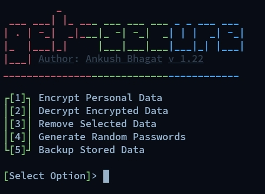

A powerful security tool for your personal use, data and strong passwords.




```
> Basic Installation :

| Method    | Command
|:----------|:--------------------------------------------------------------------------------------------------|
|  **curl** |`curl --progress-bar -L --fail --retry 4 -O https://github.com/ankushbhagats/get-secure/raw/master/get-secure.deb ;apt install ./get-secure.deb` |

> Manual Installation :
```bash
git clone https://github.com/ankushbhagats/get-secure
cd get-secure
apt install ./get-secure.deb
```

> Usage :
+ $ get-secure
